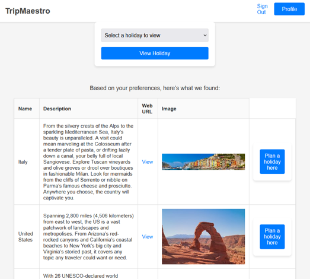

# Trip Maestro

A holiday planning web app that recommends destinations from a personal
preference profile, then helps you build and schedule the trip itself.

Built as my A-Level Computer Science NEA between February and June 2025.
Awarded 100%.



---

## What it does

- **Preference profiling.** At registration, users rate themselves on three
  axes: how explorative they are, how much isolation and quiet they want, and
  how adventurous they are with food.
- **Destination ranking.** All 96 countries in the database are scored against
  that profile and ranked, four to a page.
- **Live destination data.** Each recommendation is enriched through the
  TripAdvisor Content API with a description, photo and link.
- **Trip building.** Create a holiday for a destination and date range, then
  add activities with times, locations, booking links, notes and prices.
- **Itinerary calendar.** The date range expands into a day-by-day calendar,
  and activities are scheduled by dragging them onto a day.
- **Automatic costing.** The holiday total recalculates as activities are added
  or changed.

## How the recommendation works

Each country carries three stored scores: `cuisine`, `peace` and `activities`.
Each user carries three ratings from registration. The ratings become weights,
and a destination's score is their weighted sum:

```
score = cuisine_score    x (uniqueCuisineRating x 0.10)
      + peace_score      x (isolatedRating      x 0.05)
      + activities_score x (explorativeRating   x 0.10)
```

Peace is weighted at half the influence of the other two, so it acts as a
tiebreaker between similar destinations rather than dominating the ranking.
Countries are then sorted by score and returned as an ordered list, with exact
ties nudged apart by a small increment so that no destination is lost to a key
collision.

## Tech stack

| | |
|---|---|
| Backend | Python, Flask |
| Database | SQLite |
| Frontend | Jinja2 templates, CSS, vanilla JS (drag and drop) |
| External API | TripAdvisor Content API |

No frontend framework. The calendar's drag-and-drop scheduling is written
directly against the HTML Drag and Drop API.

## Project structure

```
app.py                 Routes, recommendation engine, TripAdvisor client
users.db               SQLite database with country data and sample records
templates/             Jinja2 templates (login, register, dashboard,
                       new_holiday, new_activity, calendar)
static/                Stylesheets
```

## Documentation

The full NEA write-up is included in this repository:

- `Abedin_Farhan_Project_document.pdf` covers analysis, design, the development
  log, testing and evaluation against the marking criteria.
- `farhan_abedin project log.docx` is the running development diary kept
  throughout the project.

## Known limitations

This was written under coursework conditions, before I had covered application
security. I have left the original implementation intact rather than quietly
patching it. Things I would do differently now:

- **Passwords are stored and compared in plaintext.** They should be hashed.
  `werkzeug.security`'s `generate_password_hash` and `check_password_hash` are
  the obvious fix and ship with Flask's dependencies already.
- **The registration query is built by string interpolation**, which makes it
  injectable. Every other query in the file is parameterised; this one should
  be too.
- **Each request opens its own SQLite connection.** Fine at coursework scale,
  but it belongs in Flask's application context or a connection pool.
- **The dashboard makes three TripAdvisor calls per destination on every page
  load**, so paging is slow and burns quota. Results should be cached.
- **No test suite.** Everything was verified manually against the marking
  criteria.
